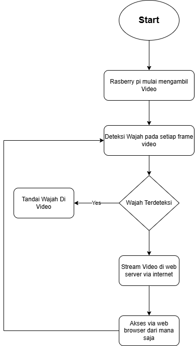

# Projek IoT_Kelompok4
# 📷 Smart Home Camera System (Face Detection via Web)

## 🧠 Deskripsi Proyek

Proyek ini merupakan sistem kamera rumah pintar berbasis **Raspberry Pi 3** yang mampu melakukan **deteksi wajah** dan **live video streaming** langsung ke browser melalui jaringan Wi-Fi. Sistem ini dirancang untuk mendukung *Sustainable Development Goal (SDG) 11*: *Sustainable Cities and Communities*, dengan menciptakan teknologi rumah yang lebih cerdas, aman, dan terhubung.

---

## 🎯 Tujuan

- Mendeteksi wajah secara real-time menggunakan kamera Raspberry Pi.
- Menampilkan hasil deteksi wajah dan video langsung melalui antarmuka web.
- Membangun sistem kamera rumah hemat biaya, efisien, dan mudah diakses melalui jaringan lokal.

---

## 🔧 Komponen

| Komponen           | Keterangan                                       |
|--------------------|--------------------------------------------------|
| Raspberry Pi 3     | Sebagai server utama dan pengolah citra wajah   |
| Kamera Raspberry Pi V2.1 | Modul kamera terhubung ke Pi (CSI port)       |
| Wi-Fi Router       | Menghubungkan Raspberry Pi ke browser pengguna |
| Web Browser        | Untuk mengakses tampilan streaming dan kontrol  |
| Power Supply       | 5V 2.5A adaptor untuk Raspberry Pi               |

---

## 🌐 Platform

- **Python** dengan framework **Flask** sebagai web server
- **OpenCV** dan **face_recognition** untuk pengolahan dan deteksi wajah
- Tampilan UI diakses via browser lokal (contoh: `http://192.168.X.X`)
- Fitur kontrol deteksi dan pemantauan wajah secara real-time

---

## ⚙️ Fitur

- 🔁 **Video streaming** real-time melalui jaringan Wi-Fi
- 👤 **Deteksi wajah otomatis** menggunakan kamera Raspberry Pi
- 💾 Penyimpanan gambar wajah baru secara lokal
- 📋 Riwayat deteksi wajah dalam format Jpeg

---

## 💡 Kontribusi terhadap SDG 11

> *"Make cities and human settlements inclusive, safe, resilient and sustainable."*

Dengan menyediakan sistem pengawasan rumah yang **hemat biaya**, **terintegrasi**, dan **mudah digunakan**, proyek ini berkontribusi terhadap:
- Keamanan hunian berbasis teknologi cerdas
- Peningkatan kualitas hidup masyarakat urban
- Pemanfaatan teknologi IoT untuk lingkungan berkelanjutan

---

## 🚀 Cara Kerja

1. Raspberry Pi 3 menjalankan server web Flask.
2. Kamera Raspberry Pi menangkap video secara real-time.
3. Aplikasi melakukan deteksi wajah setiap beberapa frame.
4. Jika ditemukan wajah baru, disimpan otomatis ke folder lokal.
5. Pengguna mengakses sistem melalui browser untuk melihat streaming, log deteksi, dan gambar wajah.

---

## 📅 Timeline Proyek

Tasks deadline:
- ✅ Task 1 (topik dan repo) : https://forms.office.com/r/8tWUJSvWU9
- ✅ Task 2 (diagram blok sistem) : 25 Mei 2025
- ✅ Task 3 (desain sistem lengkap UI/UX software dan hardware) : 1 Juni 2025
- ✅ Task 4 (Implementasi hardware) : 8 Juni 2025
- ✅ Task 5 (Implementasi software) : 15 Juni 2025
- ✅ Task 6 (Integrasi software + hardware) : 22 Juni 2025
- ✅ Task 7 (Pengujian sistem dan penyempurnaan) : 29 Juni 2025
- 🔳 Task 8 (Laporan akhir) via e-learning : 6 Juli 2025

---
## 📸 Diagram

---

## ✍️ Penulis

Proyek ini dibuat oleh [Christo.Z.A Dan Aom.R],.

